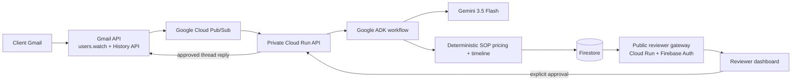

# ScopeLock

ScopeLock is an approval-gated AI workflow for turning a client Gmail message into an SOP-backed project proposal. It monitors the same thread for scope changes, calculates the commercial impact deterministically, and prepares a revised proposal for human approval.

## Hosted demo

Open the public reviewer dashboard:

**https://scopelock-reviewer-181669186571.asia-southeast1.run.app/review/**

The reviewer dashboard is a scoped demo inbox, not a personal Gmail inbox. Sign in with Firebase email-link authentication, then send a project requirement email from that same address to the dedicated demo mailbox supplied with the submission. Return to the dashboard after processing completes.

The public gateway protects the private Cloud Run API. Reviewers do not need the operator API key and must not be given it. Proposal sends remain blocked until an explicit approval action.

## What the demo proves

1. A client sends project requirements by Gmail.
2. Gmail push and Pub/Sub wake the Cloud Run backend.
3. Google ADK and Gemini 3.5 Flash extract intent and select SOP modules.
4. Deterministic application code calculates price, timeline, and scope delta.
5. Firestore stores the proposal, evidence, state transitions, and audit trail.
6. The reviewer inspects the proposal and email draft, then approves sending.
7. A later client reply is classified as clarification or scope change.
8. ScopeLock prepares a revised change order for a second approval.

## Architecture



AI is limited to bounded intent and scope understanding. Pricing, timelines, state transitions, idempotency, approvals, and sends are application-owned and deterministic.

## Reproducible local setup

Requirements: Python 3.13, `uv`, Node.js 22, and npm.

From the repository root:

```powershell
uv venv --python 3.13 .venv313
$env:UV_PROJECT_ENVIRONMENT = ".venv313"
uv sync --locked --python 3.13 --extra dev
.\.venv313\Scripts\Activate.ps1
python -m pytest -q
```

Run the frontend checks:

```powershell
cd frontend
npm ci
npm run lint
npm run build
```

Run the deterministic workflow rehearsal without Gmail or cloud credentials:

```powershell
cd ..
python -m scopelock.cli initial-proposal --repeat 2
python -m scopelock.cli golden-path
```

Run the native ADK application locally:

```powershell
adk web . --port 8000 --no-reload
adk run app
```

For the live operator API, configure required environment variables in a local `.env` file and start:

```powershell
uvicorn scopelock.http_api:app --host 127.0.0.1 --port 8080
```

Never commit `.env`, OAuth refresh tokens, service-account keys, or operator API keys. Deterministic tests do not require cloud credentials.

## Google Cloud services

- Cloud Run: private Python API and public reviewer gateway
- Firestore: projects, scope history, proposal versions, approvals, sends, and audit records
- Pub/Sub: authenticated Gmail push delivery
- Vertex AI: Gemini 3.5 Flash through Google ADK
- Gmail API: mailbox watch, History API reads, drafts, and approval-gated sends
- Firebase Authentication: reviewer email-link sign-in

## Repository layout

```text
app/                 ADK root agent, sub-agents, and narrow tools
scopelock/           Deterministic domain and application services
frontend/            Vite + React + TypeScript reviewer/operator UI
config/              Example SOP configuration
tests/               Unit, integration, contract, and ADK evaluation tests
evals/               Curated semantic evaluation corpus
scripts/             Local checks and deployment helpers
```

## Technology disclosure

ScopeLock uses Google ADK, Gemini through Vertex AI, Gmail API, Cloud Run, Pub/Sub, Firestore, Firebase Authentication, FastAPI, Pydantic, React, Vite, Tailwind CSS, ReportLab, and their locked dependencies. Exact Python and Node versions are pinned in `uv.lock` and `frontend/package-lock.json`.
