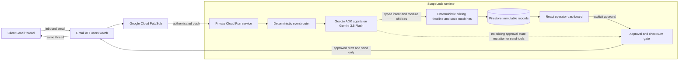

# ScopeLock

ScopeLock is an ADK-first, approval-gated agent that turns an inbound client
email into an SOP-aligned proposal, then monitors the same thread for material
scope changes.

Start with `AGENTS.md`. Official hackathon rules override this repository's
context documents if there is a conflict.

## Contents

- `AGENTS.md` — authoritative build instructions and anti-drift rules
- `config/jvl_sop.example.yaml` — illustrative machine-readable SOP
- `evals/scopelock_eval_cases.jsonl` — 25 starter semantic eval cases
- `app/agent.py` — ADK-native `ScopeLock` root agent
- `app/sub_agents/requirement_analyzer.py` — typed new-project analyzer
- `app/sub_agents/scope_analyzer.py` — typed existing-project scope analyzer
- `app/tools/` — narrow, read-only ADK tools
- `scopelock/` — deterministic domain and application code, outside agents
- `frontend/` — Vite-built static React operator console
- `tests/` — unit, integration, and native ADK evaluation assets

## One-line product

ScopeLock turns an inbound client email into an SOP-aligned proposal for review, sends it after approval, and then autonomously monitors the Gmail thread for commercially meaningful scope changes.

## Hosted judging URL

The combined operator console and API are deployed at:

**https://scopelock-api-33aorietwa-as.a.run.app/?demo=1**

The core Cloud Run service is intentionally private (`Require authentication`).
The `demo=1` route is read-only and uses synthetic fixture data, but Cloud Run
IAM still applies before the application can serve it. A direct anonymous
browser visit therefore returns `403`; do not share the operator API key, Gmail
OAuth refresh token, or Secret Manager values.

For asynchronous judging, deploy the separate public reviewer gateway described
in `docs/CLOUD_RUN_DEPLOYMENT.md` and submit its `/review/` URL. The gateway
accepts Firebase email-link sign-in, forwards only `/api/reviewer/*` to the
private core, and never exposes the operator API key. The reviewer dashboard is
explicitly a **ScopeLock demo inbox** view—not the judge's personal Gmail
inbox. A judge uses the same email address for sign-in and for the test email
sent to the dedicated demo mailbox.

Firestore and Firebase Authentication are separate services. Creating the
Firestore database does not enable email-link Auth; initialize Identity
Platform, enable Email link, and add the gateway domain to Firebase's
authorized domains before publishing the reviewer URL.

The live Gmail workflow is owner-controlled: the dedicated demo mailbox is
authorized once through Google OAuth, while commercial actions remain approval
gated in the private core. Judges do **not** connect their personal Gmail
account; they only send a test email to the dedicated demo mailbox after
opening a reviewer session. The owner does not need to be online for background
analysis or later review.

## Reproducible setup and testing

ScopeLock requires Python 3.13. The verified ADK development environment is
`.venv313`.

From the repository root:

```powershell
uv python install 3.13
uv venv --python 3.13 .venv313
$env:UV_PROJECT_ENVIRONMENT = ".venv313"
uv sync --locked --python 3.13 --extra dev
.\.venv313\Scripts\Activate.ps1
python --version
python -m pytest -q
```

The project `uv.lock` pins the resolved dependency set. Verified on
2026-08-29 with Python 3.13.14, ADK 2.8.0, the Gmail API/OAuth clients,
successful ADK discovery, pytest 9.1.1, and the reviewed pre-Gmail agent gate.
The latest complete local suite passes **225 tests**.
This uv-managed environment does not require an embedded `pip` module.

### Reproducible testing

From the repository root, after activating `.venv313`:

```powershell
python -m pytest -q
cd frontend
npm ci
npm run lint
npm run build
```

For the native ADK evaluation gate, run the commands in the ADK workflow below
or execute `.\scripts\test-agent-plan.ps1`. The reviewed live-model evals use
`.\scripts\test-agent-plan.ps1 -LiveAdk` and require the configured Vertex AI
project; deterministic tests do not require cloud credentials.

## Development workflow

ScopeLock is developed ADK-first. The current hierarchy is:

```text
ScopeLock (root agent)
├── Requirement Analyzer (typed new-project analysis)
└── Scope Analyzer (typed existing-project change analysis)
```

### Architecture



Gemini performs bounded interpretation. Application code owns commercial
calculation, state transitions, idempotency, and send authorization. A Gmail
send is unreachable until the exact sealed artifact version has a matching
human approval.

Requirement Analyzer v5 passes 12/12, Scope Analyzer v4 passes 35/35, both
native ADK trajectory cases pass, and the focused repeatability gate passes
18/18. The agent gate passed and the user explicitly unlocked the thin operator
UI on 2026-08-30. Hosted Gmail activation and the end-to-end approval/change
order path are recorded in `docs/evidence/HOSTED_PRECHECK_2026-08-31.md` and
`docs/evidence/FINAL_DEMO_READINESS_AUDIT.md`.

The ADK app selector displays `app` because that name must match the
discoverable `app/` package. The root agent inside it is named `scopelock`.

After activating `.venv313`, use native ADK tools from the repository root:

```powershell
adk web . --port 8000 --no-reload
adk run app
adk eval app tests/eval/requirement_analyzer.evalset.json `
  --config_file_path tests/eval/requirement_analyzer.config.json `
  --print_detailed_results
adk eval app tests/eval/scope_analyzer.evalset.json `
  --config_file_path tests/eval/scope_analyzer.config.json
adk eval app tests/eval/workflow_trajectories.evalset.json `
  --config_file_path tests/eval/workflow_trajectories.config.json
```

Run the complete agent-plan regression gate with one command:

```powershell
.\scripts\test-agent-plan.ps1
.\scripts\test-agent-plan.ps1 -LiveAdk
```

The first command runs all deterministic contract, unit, and integration tests.
`-LiveAdk` then runs all three reviewed eval sets against Vertex AI and inspects
ADK's result JSON, because the ADK command can return exit code zero even when a
custom semantic metric fails a case.

`adk web` should be the main interactive development loop. The local `.adk/`
directory it creates is ignored. The JSONL corpus remains the curated source
set; promote specification-reviewed cases into `tests/eval/` for native ADK runs.

### Deterministic local workflow

Use the reviewed fixture to run the application-owned proposal path without a
frontend or live Gmail call:

```powershell
python -m scopelock.cli initial-proposal --repeat 2
python -m scopelock.cli golden-path
```

The first command proves initial-proposal idempotency and ends at
`AWAITING_USER_REVIEW`. The second rehearses the documented post-acceptance
change-order story: initial approval, `NO_CHANGE`, LINE `EXPANSION`, semantic
closure, +USD 1,500 / +5 days, and a second approval-bound local send intent.
Generated proposal data and Markdown are written under the ignored
`artifacts/local_workflow/` directory.

### Audited Requirement Analyzer runner

Use the application-owned runner when a development run must persist validated
metadata and tool actions independently of ADK's internal session format:

```powershell
python -m scopelock.adk_runner "Paste an inbound project-requirement email here."
```

Each run writes an ignored local bundle under
`artifacts/agent_runs/<run-id>/`:

- `agent_run.json` contains correlation ID, agent, model, prompt version, input
  hash, status, validated output, error metadata, and timestamps.
- `tool_actions.jsonl` contains ordered tool calls and results.

Schema-invalid output, missing final output, or unknown SOP modules become
`NEEDS_REVIEW`. Configuration or transport failures become `FAILED`. Neither
path has access to a send tool.

### One-time Google Cloud setup

The application loads `GOOGLE_CLOUD_PROJECT`, location, Vertex mode, and model
from `.env`. The gcloud CLI does not automatically read `.env`, so use the
project setup script instead of repeatedly typing the project ID:

```powershell
.\scripts\configure-gcp.ps1
```

The script sets the gcloud project, enables `aiplatform.googleapis.com`, sets
the Application Default Credentials quota project, and verifies that the API
is enabled. To check configuration without changing cloud state:

```powershell
.\scripts\configure-gcp.ps1 -VerifyOnly
```

### Gmail runtime

The FastAPI-compatible Gmail/event and operator-command surface lives at
`scopelock.http_api:app`. It keeps OAuth, History API, approval, draft/send,
and scope-version mutation outside ADK tools.

```powershell
uvicorn scopelock.http_api:app --host 127.0.0.1 --port 8080
```

The local process reads `.env` when it starts. After changing
`SCOPELOCK_OPERATOR_API_KEY`, stop and restart Uvicorn before testing it.
To verify that the running local server accepts a key without printing or
persisting that key, keep Uvicorn running and use:

```powershell
$operatorKeySecure = Read-Host "Paste SCOPELOCK_OPERATOR_API_KEY" -AsSecureString
$operatorKeyBstr = [IntPtr]::Zero
try {
  $operatorKeyBstr = [Runtime.InteropServices.Marshal]::SecureStringToBSTR($operatorKeySecure)
  $operatorKey = [Runtime.InteropServices.Marshal]::PtrToStringBSTR($operatorKeyBstr)
  $response = Invoke-WebRequest -UseBasicParsing `
    -Uri "http://127.0.0.1:8080/api/session" `
    -Headers @{ "X-ScopeLock-Operator-Key" = $operatorKey } `
    -ErrorAction Stop
  if ($response.StatusCode -eq 200) {
    Write-Host "Accepted: the local server is using this operator key."
  }
} catch {
  $statusCode = if ($_.Exception.Response) { [int]$_.Exception.Response.StatusCode } else { 0 }
  if ($statusCode -eq 401) {
    Write-Host "Rejected (401): the supplied key and local server key differ. Restart Uvicorn after updating .env."
  } else {
    Write-Host "The key check could not complete (HTTP $statusCode). Confirm Uvicorn is running on port 8080."
  }
} finally {
  if ($operatorKeyBstr -ne [IntPtr]::Zero) { [Runtime.InteropServices.Marshal]::ZeroFreeBSTR($operatorKeyBstr) }
  Remove-Variable operatorKey -ErrorAction SilentlyContinue
}
```

`/api/session` verifies the operator key only; it deliberately does not load
Firestore, Gmail, or Vertex. `200` means the key matches. `401` means it does
not. It never returns the key.

Pass `docs/GMAIL_SECURITY_GATE.md`, then follow
`docs/GMAIL_OAUTH_AND_PUBSUB_SETUP.md` before calling `/gmail/watch` or
connecting a Pub/Sub push subscription. No commercial email is sent without a
current approval bound to the exact artifact version and checksum; accepted
scope also requires a persisted same-client/same-thread Gmail message.

### Operator dashboard

The operator console uses Vite 7.3.6, React, TypeScript, and Tailwind. It builds
a static SPA for `/` and `/settings/`. FastAPI serves that build
from the same origin as the policy-checked API, so the existing Cloud Run image
hosts both frontend and backend.

The deployed core service remains private. Use an authenticated `gcloud run
services proxy` connection for the owner-only operator workflow; a direct
browser visit to the core `run.app` URL does not supply Cloud Run IAM
credentials. Public reviewer access uses the separate gateway documented in
`docs/CLOUD_RUN_DEPLOYMENT.md`.

For a local or owner review, the `?demo=1` route is a safe read-only fixture. It
does not call Gmail or mutate Firestore. The live reviewer path is a scoped
Firebase email-link session: it does not require an operator key, and its
projection is restricted to the signed-in sender's project.

To exercise the live golden path as the owner/operator:

1. Open the operator console through the authenticated Cloud Run proxy (or the
   temporary reviewer access method listed in the submission note).
2. Send a normal email from any client address to the dedicated demo mailbox.
   The mailbox address is provided separately with the submission/testing note;
   it is intentionally not embedded in this public repository.
3. Gmail `users.watch` resolves the notification through Pub/Sub. Cloud Run
   reads the thread, analyzes the request, calculates the SOP-backed price and
   timeline, and persists the draft in Firestore. Refresh Overview to see it.
4. The owner/operator reviews the proposal and enters the operator key to
   approve and send. Judges should never receive or share that key.

For an asynchronous judge, use the gateway `/review/` URL instead. Sign in
with the email link, send the test requirement from that same address to the
dedicated demo mailbox, then return later to review the agent's draft. The
reviewer routes enforce the same approval policy and never expose the core
operator API key.

```powershell
# Terminal 1, from the repository root
uvicorn scopelock.http_api:app --host 127.0.0.1 --port 8080

# Terminal 2
cd frontend
npm install
npm run dev
```

Open `http://127.0.0.1:5173`. During development, Vite proxies `/api`,
`/artifacts`, `/buffers`, `/gmail`, and `/health` to the local FastAPI service.
This lets the live operator console use the same header-only key flow without a
Vite build, Docker build, or Cloud Run deployment. The proxy exists only in the
development server; the production image still serves the built SPA and API
from one origin.

To preview the dashboard through a Cloud Run service proxy instead, set
`VITE_API_PROXY_TARGET` before starting Vite (the default remains port 8080):

```powershell
$env:VITE_API_PROXY_TARGET = "http://127.0.0.1:8082"
npm run dev
```

For a production-style local build:

```powershell
npm run lint
npm run build
cd ..
uvicorn scopelock.http_api:app --host 127.0.0.1 --port 8080
```

Open `http://127.0.0.1:8080/?demo=1` for the clearly labelled, read-only
reviewed fixture. Live mode requires the operator key. The key remains only in
page memory and is never embedded in the frontend build, URL, cookie, or browser
storage. Approve, draft, and send remain separate backend-enforced actions.

### Cloud Run cost guardrail

The live `scopelock-api` service was checked on 2026-08-31: `maxScale=1`,
`containerConcurrency=1`, and no `minScale` annotation (Cloud Run's effective
minimum is therefore `0`). This lets an idle service scale to zero and limits
burst capacity, but it does **not** guarantee a zero bill. Requests can still
use billable CPU/memory and networking, and Firestore, Pub/Sub, Vertex AI,
Secret Manager, and Gmail have separate usage/free-tier rules. Review the
project billing account before and after the judging window.

Use the Vite development server until the local UI and agent rehearsal are
locked. Only then run the Docker/Cloud Build deployment workflow. The combined
Cloud Run image runs the same production build through the repository
`Dockerfile`.

The backend container is defined by `Dockerfile` and starts through the
fail-closed `scopelock.cloud_run` entry point. Follow
`docs/CLOUD_RUN_DEPLOYMENT.md`; never upload local `.env`, OAuth files, tokens,
or service-account keys in a Cloud Build context.

## Hackathon and third-party disclosure

The recorded Git history for this repository begins on 2026-08-27, inside the
All Things Agentic Hackathon build window. ScopeLock's application code, agent
prompts, tests, demo fixtures, and operator UI in this repository were created
for this entry. No client code, client data, testimonials, or prior performance
claims are included.

ScopeLock uses third-party and platform building blocks rather than claiming
them as original work: Google ADK, Gemini through Vertex AI, Gmail API, Cloud
Run, Pub/Sub, Firestore, FastAPI, Pydantic, React, Vite, Tailwind CSS,
ReportLab, and their locked transitive dependencies. Exact Python and Node
packages are recorded in `uv.lock` and `frontend/package-lock.json`. The owner
must update this disclosure before submission if any material pre-existing code
or asset is later added.

## Repository layout

```text
app/                        # ADK entry point, root agent, sub-agents, tools
scopelock/                  # deterministic business code, never agent tools
tests/                      # unit, integration, ADK eval assets
config/                     # validated business SOP
docs/                       # product, architecture, plan, demo documents
evals/                      # human-labelled semantic corpus
frontend/                   # Vite React operator UI; static output is ignored
```
